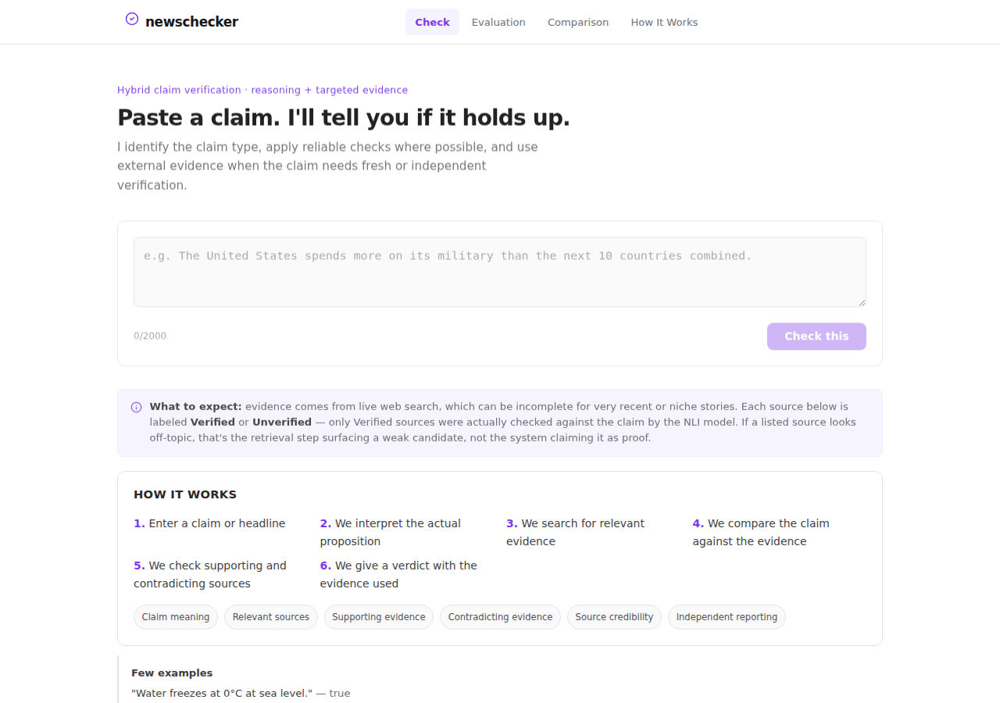
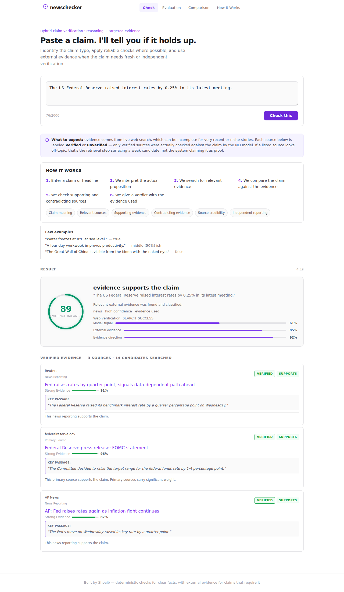
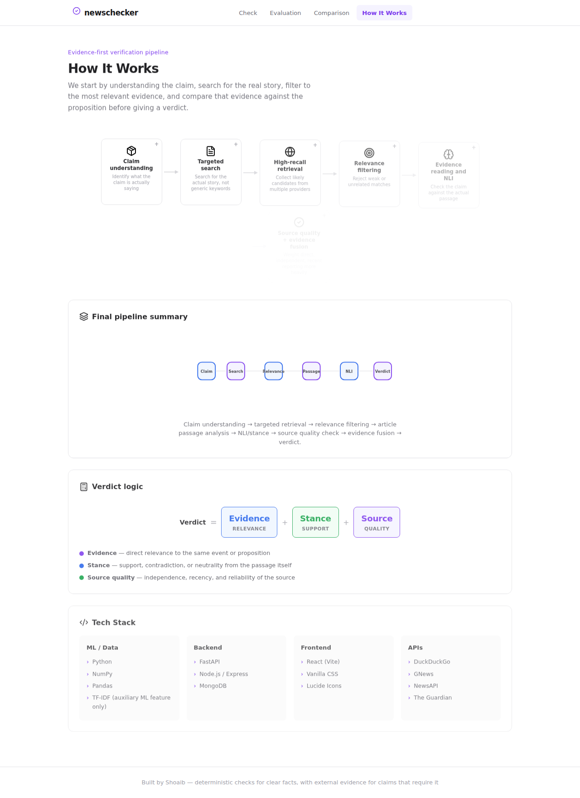
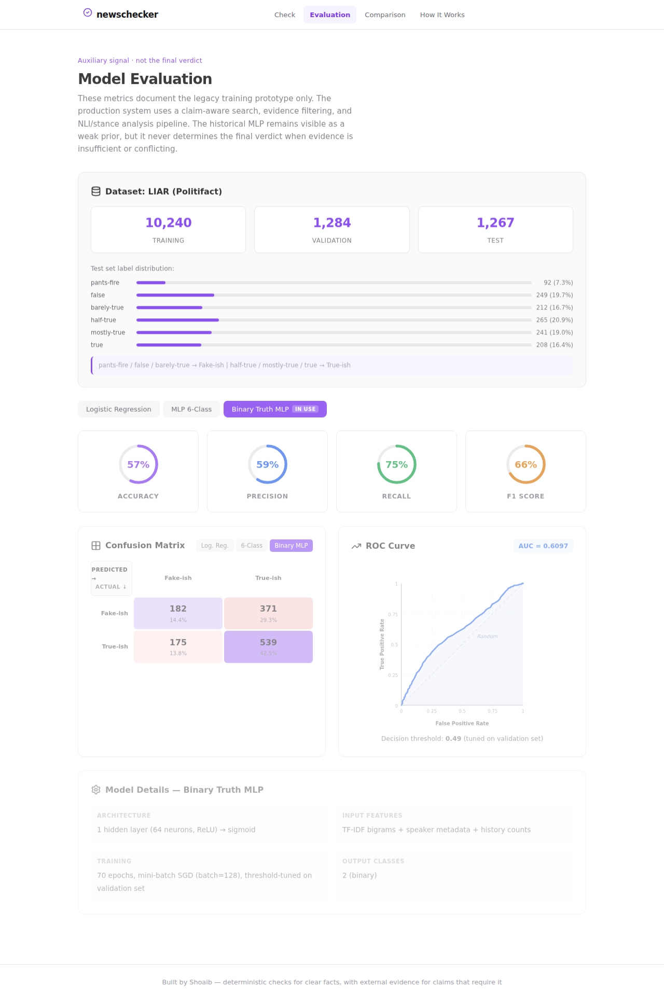
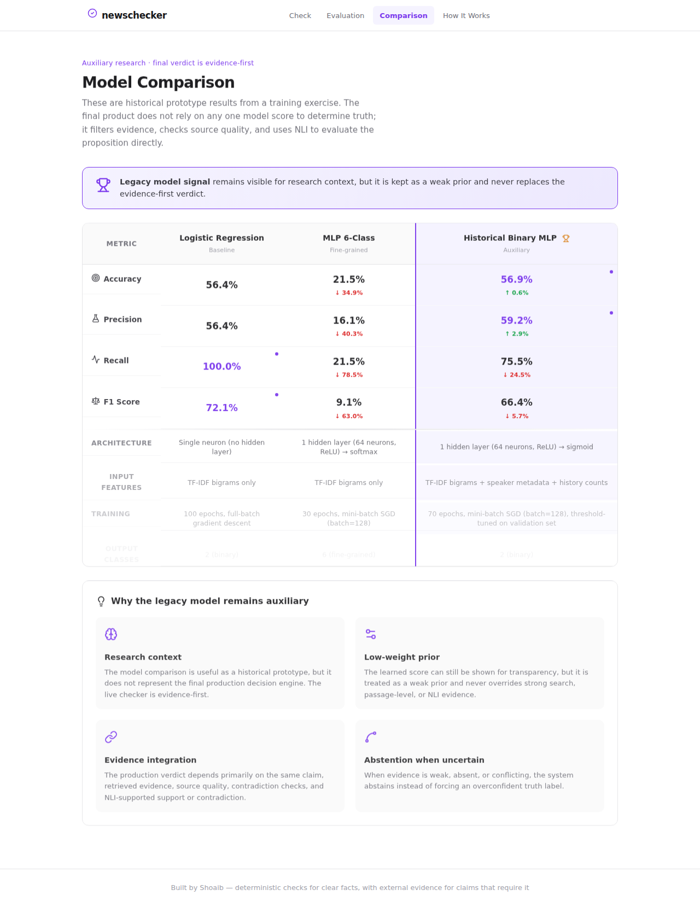
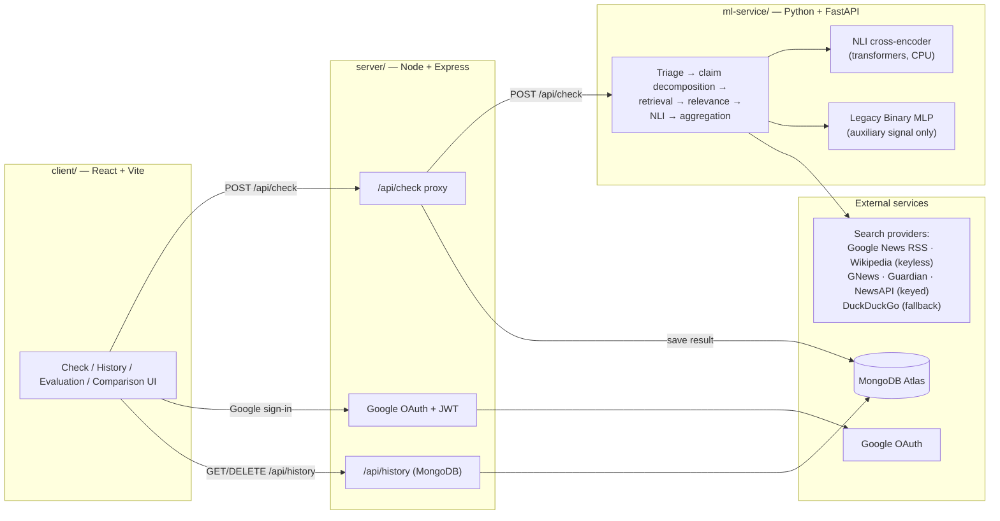
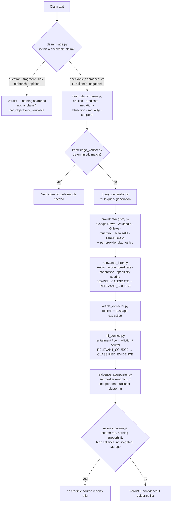

# NewsChecker

**An evidence-first fact-checking system** — paste a claim or a news headline, and NewsChecker decomposes the proposition, retrieves independent evidence from the live web, checks it against the claim with a natural-language-inference (NLI) model, and returns a conservative, evidence-backed verdict. It abstains rather than guesses when the evidence isn't there.

This is a full-stack, three-service application: a React frontend, a Node/Express API gateway, and a Python/FastAPI ML service that owns claim understanding, retrieval, and NLI verification.

<p align="center">
  
</p>

---

## Table of contents

- [What this actually does](#what-this-actually-does)
- [Screenshots](#screenshots)
- [Architecture](#architecture)
- [Design principles](#design-principles)
- [Tech stack](#tech-stack)
- [API reference](#api-reference)
  - [`POST /api/check` response schema](#post-apicheck-response-schema)
  - [`GET /api/health` response schema](#get-apihealth-response-schema)
  - [Auth & history endpoints](#auth--history-endpoints)
- [Database schema](#database-schema)
- [Environment variables](#environment-variables)
- [Local development](#local-development)
- [Testing](#testing)
- [Running this for a demo](#running-this-for-a-demo)
  - [NLI model & memory](#nli-model--memory)
- [Model performance (legacy MLP)](#model-performance-legacy-mlp)
- [Project structure](#project-structure)
- [Known limitations](#known-limitations)
- [License](#license)

---

## What this actually does

Type a claim like *"The US Federal Reserve raised interest rates by 0.25% in its latest meeting"* and NewsChecker:

1. **Triages the claim** (`claim_triage.py`) — decides what kind of question it even poses, before any network work. A question, a fragment, keyboard mash, or a value judgment is reported as such and never searched. A claim about a *future* event is marked prospective: nothing can make it true or false today. It also judges **salience** — would a true version of this claim necessarily have been reported? — and whether the claim is negated. Both feed the absence-of-coverage rule below.
2. **Understands the claim** — extracts entities, the core predicate/action, negation, attribution ("officials said" vs "officials denied"), modality (factual vs speculative), and temporal constraints.
3. **Applies a deterministic check**, for claims with an unambiguous, well-known answer (basic arithmetic, textbook science/geometry facts, a small set of verified historical facts) — no web search needed, no ambiguity.
4. Otherwise, **generates multiple targeted search queries** (exact headline, proposition, entity-pair, contradiction/verification queries) and **retrieves candidates** from several providers. Google News RSS and Wikipedia need no API key and are on by default; GNews, The Guardian and NewsAPI join in when their keys are configured.
5. **Filters for relevance** using entity, **action**, predicate, coherence and specificity scoring. Sharing a keyword with the claim — a number, an entity name — is not relevance; neither is being about the right subjects while never mentioning the event the claim asserts.
6. **Runs NLI** (natural language inference) on the surviving candidates' passages against the claim, classifying each as entailment (supports), contradiction, or neutral.
7. **Aggregates evidence** — weighting by source tier (primary/fact-check/reporting/reference/unclassified) and counting independent *publisher* domains, so five articles from one outlet don't outweigh one from another.
8. **Returns a verdict** with a categorical confidence (not a fake-precision percentage) and the actual evidence used — explicitly distinguishing sources that were *found* from sources that were *verified*, and sources that address the claim from sources that merely cover the topic.

### The verdicts it can return

The point of the triage and aggregation stages is that these are genuinely different answers. Earlier versions collapsed most of them into "insufficient evidence", which made a correct abstention indistinguishable from a bug:

| `verification.status` | Shown as | What it means |
|---|---|---|
| `supported` | evidence supports the claim | Classified sources entail the claim. |
| `contradicted` | evidence contradicts the claim | Classified sources contradict it. |
| `mixed` | claims have mixed evidence | Credible sources point both ways. |
| `reported_plan` | reported as planned — not yet done | A prospective claim that sources report as announced. Confirms the *announcement*, not the event. |
| `unsupported_no_coverage` | no credible source reports this | A real negative finding — see below. |
| `not_verifiable_yet` | not yet verifiable — describes a future event | Prospective, and not reported as announced either. |
| `not_a_claim` | no verifiable claim found | A question, fragment, link, or unparseable text. Nothing was searched. |
| `not_objectively_verifiable` | subjective — not objectively verifiable | A value judgment. |
| `insufficient_evidence` | insufficient evidence | **A limitation on our side** — the search failed, or NLI was unavailable. Never a statement about the claim. |

### Absence of coverage as evidence

The hardest case is a fabricated but highly newsworthy claim — *"Elon Musk bought the Eiffel Tower"*. Nothing contradicts it explicitly, because no outlet writes articles denying things that never happened. Reporting "insufficient evidence" there is technically true and practically useless.

So `evidence_aggregator.assess_coverage` returns **"no credible source reports this"** — but only when *every* one of these holds, because the cost of getting it wrong is asserting that nobody reported something when we simply failed to look:

1. The search actually ran (`SEARCH_SUCCESS`, `SEARCH_PARTIAL`, or `NO_RELEVANT_RESULTS` — never `SEARCH_FAILED`).
2. It returned a real pool of candidates (≥ `MIN_CANDIDATES_FOR_ABSENCE`, currently 4).
3. Nothing in that pool supported *or* contradicted the claim — a contradiction is stronger evidence and wins on its own.
4. The claim is **high-salience**: it asserts a major event, at absolute scope or in headline form, so a true version could not have gone unreported. An ordinary claim going unreported proves nothing.
5. The claim is **not negated**. No outlet reporting that the US banned Google is exactly what *"the US did not ban Google"* predicts — treating silence as evidence against a negative claim inverts the inference.
6. The **NLI model was available**. "No source supports this" is a claim about what sources say, and we only know that if something read them.

Confidence then scales with how much of the press was actually canvassed, not with how many sources were classified — the finding *is* that none were.

The one thing this system is deliberately built **not** to do: treat "a search result exists" as "evidence." A candidate only becomes evidence after it survives relevance filtering *and* gets classified by NLI. See [Design principles](#design-principles).

## Screenshots

| | |
|---|---|
| **Check a claim** — evidence-first verdict with per-source Verified/Unverified labeling | **How It Works** — the full pipeline, explained |
|  |  |
| **Model Evaluation** — honest, non-inflated legacy-MLP metrics | **Model Comparison** — why the legacy model stays auxiliary |
|  |  |

<!-- This project runs locally for demos rather than staying deployed — see
"Running this for a demo" below for why. If you do stand up a public
deployment later, drop a screenshot of it here. -->

## Architecture

Three independently deployable services:



The evidence pipeline itself, inside `ml-service/`:



## Design principles

These are the non-negotiable rules the codebase is built around — they were the direct fixes for real bugs found during development, not aspirational goals:

- **A search result is not evidence.** A candidate only counts as evidence after it passes relevance filtering *and* gets NLI-classified. The API separates `retrieval.candidate_count` (raw search hits) from `nli.classified_count` (actually checked) from `evidence.supporting_count + contradicting_count + neutral_count` (classified evidence by stance) — and the frontend never collapses these into one number.
- **NLI unavailable ≠ neutral.** If the NLI model can't be reached or fails to load, every score comes back `available: false` and the caller must treat it as abstention — never as a "neutral" classification, which would be a false signal.
- **Never rewrite the claim before checking it.** Splitting user input on sentence boundaries had no abbreviation handling and discarded short fragments, so *"The U.S. government banned Google across all cities"* became *"government banned Google across all cities"* — the subject deleted before anything was searched — and *"Apple, Google; and Microsoft were all fined"* became *"and Microsoft were all fined"*. Abbreviation protection is shared with the article splitter, and a split that orphans a fragment is abandoned in favour of the whole statement.
- **The deterministic layer only answers plain statements.** `knowledge_verifier` returns `very high` confidence and skips retrieval and NLI entirely, so a false positive there is the most confidently wrong output the system can emit. Its pattern tables match substrings, which meant *"It is false that a triangle has four sides"* (a true statement) was answered **false**, and *"Nobody claims WWII ended in 1945"* (a false statement) was answered **true**. Negated, quoted, or commented statements are now declined and handed to the evidence pipeline.
- **"Nothing to check" ≠ "couldn't check it".** `claim_triage.py` runs before any network call. A question, a bare link, an unparseable string, or a value judgment gets `not_a_claim` / `not_objectively_verifiable` and is never searched — reporting a verification failure for text that contains no proposition tells the user their claim was checked and found wanting, which is false.
- **A claim about the future cannot be true or false yet.** Prospective claims are never returned as `supported`. Coverage of them yields `reported_plan` — the plan was reported, which is not the same as the event happening.
- **Absence of coverage is evidence only under narrow conditions.** See [Absence of coverage as evidence](#absence-of-coverage-as-evidence). In particular it never applies to a negated claim, never when the search failed, and never when NLI was unavailable.
- **Being about the right subjects isn't relevance.** `relevance_filter.py` scores whether a document discusses the *action* the claim asserts, using a synonym vocabulary so different wording still matches ("resigned" / "steps down"). For the claim *"the US is going to ban Google"*, an article headlined "Google expands advertising tools in the United States" scored 0.68 and survived strict filtering purely because both entities appeared in it.
- **An article that addresses nothing is not evidence for anything.** Sources NLI classifies as neutral are shown under *Related coverage*, explicitly not counted. They previously sat under a heading counting them as evidence, with each card asserting the source "supports" or "contradicts" the claim based on whichever score was larger — 0.04 against 0.03.
- **Search failure ≠ no evidence ≠ false.** `retrieval.status` distinguishes `SEARCH_FAILED` (all providers errored), `NO_RESULTS` (providers ran, found nothing), `NO_RELEVANT_RESULTS` (results found, none relevant), and `SEARCH_SUCCESS`/`SEARCH_PARTIAL`. These are never conflated.
- **The legacy MLP never determines the verdict.** `binary_truth_mlp.py` is a from-scratch neural net trained on the LIAR political-statements dataset. It's shown in the API response (`ml.score`) for transparency, flagged `auxiliary_only: true`, but the verdict computation (`evidence_verdict_score`, `merge_claim_summaries`) never reads it.
- **NLI label order is not standardized across models — never guess it.** Different NLI models emit their entailment/contradiction/neutral labels in different, undocumented orders. `nli_service.py` only trusts a model's real named labels (order-independent) or an explicit, manually-verified per-model lookup table — an unrecognized model emitting raw `LABEL_0`/`LABEL_1`/`LABEL_2` output makes the service report `failed` and abstain, rather than risk silently inverting every verdict.
- **A debunking article is not evidence for the thing it debunks.** A fact-check quotes the claim it refutes — *"Posts claim the United States banned Google in all its cities"* — and an NLI model scores that as strongly entailing, because the claim is literally in the sentence. The strongest entailment and the strongest contradiction are found **independently** across passages, and passages that merely *report* a claim (`_CLAIM_REPORTING_FRAME`) are excluded from the entailment maximum. Ordinary attribution ("officials said", "according to") is deliberately untouched — that is journalism reporting a fact. Reading both scores off whichever single passage scored highest recorded PolitiFact debunkings as *supporting* the claim, at 0.95 source weight.
- **A document arguing both ways is evidence for neither.** When both directions clear the score threshold, one must be `STANCE_DOMINANCE` (1.6×) stronger to be called the document's position; otherwise its stance is `unclear`. Without that, 0.88 against 0.72 read as a confident "supports".
- **The verdict must be monotonic in the evidence.** Direction scores are weighted means over the sources that *take* that direction, not over everything classified. Averaging in neutrals made the system non-monotonic: one Reuters article entailing a claim at 0.93 gave `supported`, and adding three on-topic articles that said nothing either way dragged the mean to 0.26 and turned the same evidence into `insufficient_evidence`. More evidence, none of it disagreeing, made it less certain.
- **"Mixed" means genuinely contested, not merely two-sided.** A direction wins outright when its weighted mass is at least `DOMINANCE_RATIO` (2×) the other side's. On raw counts, one 0.40 contradiction from an unclassified blog was filed as equal to five strong reports from reputable outlets.
- **Repeated coverage from one outlet isn't independent confirmation.** `evidence_aggregator` counts distinct **publisher** domains per direction (`independent_supporting` / `independent_contradicting`), and **confidence is scaled by those, not by article count** — four copies of one wire story under one masthead are one confirmation, and used to earn "high" confidence. Aggregator links are resolved to the real publisher first (`claim_verifier.resolve_publisher_host`) — counting by URL host would have filed ten different newsrooms reached through Google News as a single origin, and tiered every one of them as "unclassified".
- **Confidence is categorical, not fake-precision.** The UI shows `low` / `medium` / `high` / `very high`, not a `73.42%` number implying a calibration that doesn't exist. Where a percentage bar *is* shown (evidence-balance visualization), it reads "—" / "Not available" instead of a misleading number when there's no classified evidence to measure.

## Tech stack

| Layer | Technology |
|---|---|
| **Frontend** | React 19, Vite, vanilla CSS (no UI framework), Lucide icons, Google Identity Services |
| **API gateway** | Node.js, Express 5, Mongoose, JSON Web Tokens, `google-auth-library` |
| **ML service** | Python 3.11, FastAPI, Uvicorn, NumPy, Pandas |
| **NLI** | HuggingFace `transformers` + PyTorch (CPU-only wheel), a cross-encoder NLI model |
| **Legacy ML** | From-scratch NumPy MLP + TF-IDF vectorizer (no sklearn/PyTorch) — auxiliary signal only |
| **Search providers** | Google News RSS + Wikipedia (keyless, on by default), GNews / The Guardian / NewsAPI (optional, key-gated), DuckDuckGo HTML (fallback) |
| **Database** | MongoDB (Atlas or self-hosted) via Mongoose |
| **Deployment** | Run locally for demos (see [Running this for a demo](#running-this-for-a-demo)); Render + Vercel configs included for reference |

## API reference

### `POST /api/check`

Request:

```json
{ "statement": "The US Federal Reserve raised interest rates by 0.25% in its latest meeting." }
```

`statement` must be 5–2000 characters.

#### `POST /api/check` response schema

This is the actual `CheckResponse` shape from `ml-service/main.py`, proxied unchanged by `server/routes/check.js` (with `_id` attached if the check was saved to history):

```jsonc
{
  "statement": "The US Federal Reserve raised interest rates by 0.25% in its latest meeting.",
  "claim_type": "news",              // "general factual" | "scientific" | "mathematical" | "historical" | "news" | "subjective" | ...
  "verdict": "true",                 // human-readable verdict string
  "confidence": "high",              // "low" | "medium" | "high" | "very high" — categorical, not a percentage

  // The core verification outcome — read this first.
  "verification": {
    "status": "supported",           // "supported" | "contradicted" | "mixed" | "insufficient_evidence" | "not_objectively_verifiable"
    "reasoning": "Relevant external evidence was found and classified."
  },

  // The legacy MLP signal. Advisory only — never drives the verdict.
  "ml": {
    "available": true,
    "auxiliary_only": true,
    "score": 0.61,                   // 0–1 probability from the LIAR-trained MLP
    "verdict": "probably correct",
    "threshold": 0.49
  },

  // What happened during the search phase.
  "retrieval": {
    "status": "SEARCH_SUCCESS",      // "SEARCH_SUCCESS" | "SEARCH_PARTIAL" | "SEARCH_FAILED" | "NO_RESULTS" | "NO_RELEVANT_RESULTS"
    "candidate_count": 14,           // raw search results across all providers/queries, deduplicated
    "relevant_count": 6,             // survived relevance filtering (still NOT yet "evidence")
    "diagnostics": [                 // per-provider, per-query outcome — never silently swallowed
      { "provider": "gnews", "query": "...", "enabled": true, "status": "success", "raw_result_count": 4, "normalized_result_count": 3, "error": null }
    ]
  },

  // NLI model state and how much evidence it actually classified.
  "nli": {
    "available": true,
    "status": "ready",               // "disabled" | "loading" | "ready" | "failed"
    "classified_count": 3            // sources that were actually run through NLI
  },

  // Aggregated evidence AFTER NLI classification — this is the real "evidence used" count.
  "evidence": {
    "supporting_count": 3,           // classified sources that entail the claim
    "contradicting_count": 0,
    "neutral_count": 0,              // checked, addressed neither side — shown as "Related coverage"
    "independent_groups": 3,         // distinct publishers across ALL classified evidence (search breadth)
    "independent_supporting": 3,     // distinct publishers backing each direction. THESE are what a
    "independent_contradicting": 0   // verdict rests on, and what scales confidence — not the counts above
  },

  // ── Legacy/flattened fields, kept for backward compatibility ──
  "ml_score": 0.61,
  "ml_verdict": "probably correct",
  "ml_threshold": 0.49,
  "evidence_score": 0.85,
  "evidence_stance": { "support": 0.85, "contradiction": 0.02, "net": 0.83, "verdict": "evidence supports the claim", "status": "supported", "..." : "..." },
  "combined_score": 89,              // 5–95 visual evidence-balance score — NOT a probability of truth
  "combined_verdict": "evidence supports the claim",
  "assessment_status": "supported",
  "claim_assessments": [
    { "claim": "...", "status": "supported", "verdict": "evidence supports the claim", "support": 0.85, "contradiction": 0.02, "evidence_count": 3 }
  ],
  "top_evidence": [
    {
      "title": "Fed raises rates by quarter point, signals data-dependent path ahead",
      "url": "https://reuters.com/markets/fed-rate-decision",
      "similarity": 0.0,               // not used as a relevance/truth score, kept for schema compatibility
      "stance": "supports",            // "supports" | "contradicts" | "unclear"
      "source": "Reuters",
      "best_sentence": "The Federal Reserve raised its benchmark interest rate by a quarter percentage point on Wednesday.",
      "support_score": 0.91,
      "contradiction_score": 0.02,
      "source_tier": "reporting",      // "primary" | "fact-check" | "reporting" | "reference" | "unclassified"
      "nli_available": true,           // false ⇒ this is an unverified CANDIDATE, not evidence
      "publisher": "reuters.com"       // who actually published it; differs from the URL host for aggregator links
    }
  ],
  "processing_time_seconds": 4.1,
  "reasoning": "Searched 12 sources across the configured news, reference and web providers; 3 discussed this claim and 3 were compared against it by the NLI model. 3 classified sources from 3 independent publishers support this claim.",
  "external_evidence_available": true,
  "external_evidence_checked": true   // false ⇒ nothing was searched (deterministic check, or not a checkable claim)
}
```

`verification` carries the outcome and the triage facts behind it:

```jsonc
"verification": {
  "status": "unsupported_no_coverage",  // see the verdict table above
  "reasoning": "Searched 14 sources ... the absence of any coverage is itself evidence against the claim.",
  "claim_kind": "checkable",            // "checkable" | "prospective" | "opinion" | "not_a_claim"
  "salience": "high"                    // "high" ⇒ a true version would necessarily have been reported
}
```

**Reading this correctly:**

- Always check `nli_available` (or `nli.classified_count` at the top level) before treating a `top_evidence` entry as confirmation of anything. A source with `nli_available: false` was *found*, not *verified* — the frontend labels these "Unverified" for exactly this reason.
- A `top_evidence` entry with `stance: "unclear"` and `nli_available: true` was checked and found to address neither side. It is **not** evidence; the frontend files these under *Related coverage*.
- `insufficient_evidence` is a statement about this system, not about the claim. Do not render it as a negative result.

#### `GET /api/health` response schema

```json
{
  "status": "ok",
  "service": "newschecker-ml",
  "model_loaded": true,
  "input_size": 26626,
  "threshold": 0.49,
  "nli": {
    "enabled": true,
    "model": "cross-encoder/nli-deberta-v3-small",
    "status": "ready",
    "error": null
  },
  "search_providers": {
    "gnews":      { "enabled": false, "status": "no_key" },
    "guardian":   { "enabled": false, "status": "no_key" },
    "newsapi":    { "enabled": false, "status": "no_key" },
    "duckduckgo": { "enabled": true,  "status": "ready" }
  }
}
```

No secrets are ever included in this response. This should be the first thing you check when debugging a deployment.

#### Auth & history endpoints

All served by `server/` (Express), all under `/api`:

| Method | Path | Auth | Purpose |
|---|---|---|---|
| `POST` | `/api/auth/google` | — | Exchange a Google ID token for the app's own JWT |
| `GET` | `/api/auth/me` | Bearer JWT | Fetch the logged-in user's profile |
| `GET` | `/api/history?limit=&skip=` | Bearer JWT | Paginated list of the user's past checks (summary fields only) |
| `GET` | `/api/history/:id` | Bearer JWT | Full saved check, same shape as a live `/api/check` response |
| `DELETE` | `/api/history/:id` | Bearer JWT | Delete one saved check |
| `GET` | `/api/health` | — | Express proxy health (separate from the ML service's own `/api/health`) |

## Database schema

`server/models/Check.js` (Mongoose). Stores the full structured response (not just the legacy flattened fields) so that loading a check from history renders identically to a live result:

```js
{
  userId: ObjectId,              // ref User, indexed
  statement: String,
  createdAt / updatedAt,         // automatic timestamps

  // Legacy flattened fields
  mlScore: Number, mlVerdict: String,
  evidenceScore: Number,
  evidenceStance: { support, contradiction, net, verdict },
  combinedScore: Number, combinedVerdict: String,
  assessmentStatus: String,
  claimAssessments: [{ claim, status, verdict, support, contradiction, evidenceCount }],
  topEvidence: [{ title, url, similarity, stance, source, best_sentence,
                  support_score, contradiction_score, source_tier, nli_available }],
  processingTime: Number,

  // Structured schema (mirrors the live CheckResponse)
  claimType: String, verdict: String, confidence: String, reasoning: String,
  externalEvidenceAvailable: Boolean, externalEvidenceChecked: Boolean,
  verification: { status, reasoning },
  ml: { available, auxiliaryOnly, score, verdict, threshold },
  retrieval: { status, candidateCount, relevantCount, diagnostics: [Mixed] },
  nli: { available, status, classifiedCount },
  evidenceSummary: { supportingCount, contradictingCount, neutralCount, independentGroups },
}
```

`server/models/User.js` is a small Google-OAuth profile (`googleId`, `email`, `name`, `avatar`).

## Environment variables

### ML service (`ml-service/` — Render-specific vars matter only if you deploy it)

**Search providers.** Google News RSS and Wikipedia require no key and are enabled by default; set their flag to `false` to switch one off. The keyed providers are skipped (with a `disabled` diagnostic, never silently) when their key is absent. `GET /api/health` reports the live state of all six.

| Variable | Default | Purpose |
|---|---|---|
| `GOOGLE_NEWS_ENABLED` | `true` | Google News RSS. No key. Best coverage for recent headlines. |
| `WIKIPEDIA_ENABLED` | `true` | Wikipedia search. No key. Background knowledge for timeless claims. |
| `DUCKDUCKGO_ENABLED` | `true` | DuckDuckGo HTML scrape. No key, frequently rate-limited or blocked. |
| `GNEWS_API_KEY` | unset | Enables the GNews provider. |
| `GUARDIAN_API_KEY` | unset | Enables The Guardian provider. |
| `NEWSAPI_KEY` | unset | Enables the NewsAPI provider. |


| Variable | Required? | Default | Notes |
|---|---|---|---|
| `NLI_ENABLED` | No | `true` | Set `false` only to intentionally disable NLI (e.g. emergency memory mitigation). |
| `NLI_MODEL` | No | `cross-encoder/nli-deberta-v3-small` | HuggingFace model id. See [NLI model & memory](#nli-model--memory) before changing this. |
| `GNEWS_API_KEY` | No | — | Enables the GNews provider. Without it, only DuckDuckGo runs. |
| `GUARDIAN_API_KEY` | No | — | Enables The Guardian provider. |
| `NEWSAPI_KEY` | No | — | Enables the NewsAPI provider. |
| `NLI_PRELOAD` | No | `true` | Load the NLI model at startup instead of on the first request. Leave this on: lazily loading it meant the first evidence-requiring request paid for the model download *inside the HTTP request*, unbounded by `EVIDENCE_BUDGET_SECONDS`. Startup takes longer on a cold cache, but that cost is visible in the log instead of surfacing as a mystery timeout. |
| `EVIDENCE_BUDGET_SECONDS` | No | `45` | Hard ceiling on the evidence phase of one `/api/check`, shared across every extracted claim. Bounds search + article extraction so a blocked provider degrades to partial evidence instead of hanging the request. Must stay comfortably below the server's `ML_SERVICE_TIMEOUT_MS`. |
| `PORT` | No | `8000` | Set automatically by Render; the Dockerfile's `CMD` already handles `${PORT:-8000}`. |

### Server (`server/` — Vercel-specific vars matter only if you deploy it)

| Variable | Required? | Default | Notes |
|---|---|---|---|
| `MONGODB_URI` | **Yes** (for persistence) | `mongodb://localhost:27017/newschecker` | Without a reachable Mongo, the server still boots and `/api/check` still works — history/auth just won't persist. |
| `JWT_SECRET` | **Yes in production** | a hardcoded dev-only string | **The server throws at startup if `NODE_ENV=production` and this is unset** — set it before deploying. |
| `GOOGLE_CLIENT_ID` | **Yes** (for sign-in) | — | From Google Cloud Console. Must match the client's `VITE_GOOGLE_CLIENT_ID`. |
| `FASTAPI_URL` | **Yes** in production | `http://localhost:8000` | Must point at your ML service. **A stale value here is the single most confusing failure this project has**: every check is proxied to a dead host and comes back `502` while your local ml-service sits idle logging nothing, which looks exactly like a broken local service. The server now prints its forwarding target at boot and warns when it is remote — check that line first. |
| `CLIENT_URL` | No | `http://localhost:5173` | CORS origin. Only matters if client and server are deployed as separate origins. |
| `ML_SERVICE_TIMEOUT_MS` | No | `180000` | Ceiling on the Node→FastAPI proxy call, so a hung ML service can't hang Express forever. 180s by default to cover the NLI model's first-time download plus a DuckDuckGo-only retrieval pass — see [Running this for a demo](#running-this-for-a-demo). |
| `NODE_ENV` | Set by platform | — | Vercel sets this to `production` automatically — this is what triggers the `JWT_SECRET` requirement above. |

### Client (`client/` — build-time Vite variables, baked in at build)

| Variable | Required? | Default | Notes |
|---|---|---|---|
| `VITE_API_URL` | No | `""` (same-origin) | Only set this if the client is deployed as a **separate** project from the server. |
| `VITE_GOOGLE_CLIENT_ID` | **Yes** (for sign-in) | — | Public Google OAuth client ID — same value as the server's `GOOGLE_CLIENT_ID`. |

## Local development

Requires Node.js 18+, Python 3.9+, and MongoDB (local or Atlas — optional for basic `/api/check` testing).

```bash
# 1. ML service
cd ml-service
python -m venv .venv && source .venv/bin/activate   # optional but recommended
pip install -r requirements.txt
python main.py                          # http://localhost:8000

# 2. Node/Express server (new terminal)
cd server
npm install
npm run dev                             # http://localhost:3001

# 3. React frontend (new terminal)
cd client
npm install
npm run dev                             # http://localhost:5173
```

The first evidence check (a non-deterministic claim) triggers the NLI model download on first use — this can take a minute depending on your connection. Deterministic claims (basic science/math facts) never touch NLI or the network at all.

## Testing

```bash
# ML service — 93 tests covering claim triage, claim decomposition, relevance
# and action filtering, query generation, NLI label-mapping safety, evidence
# aggregation, absence-of-coverage rules, provider failure/diagnostics
# handling, keyless-provider parsing, pipeline time budgets, and end-to-end
# verdict behaviour for every claim shape (tests/test_claim_edge_cases.py).
cd ml-service
pip install -r requirements.txt
python -m pytest tests/ -q
# (falls back to: python -m unittest discover -s tests -v)

# The provider tests verify PARSING against real payload shapes; they make no
# network calls, so they do not prove either endpoint is reachable from a
# given machine. To check reachability:
#   python -c "from providers.google_news import search; print(len(search('test')))"
#   python -c "from providers.wikipedia import search; print(len(search('Eiffel Tower')))"

# Client — lint + production build
cd client
npm run lint
npm run build
```

There is currently no automated test suite for `server/` (the Express layer) — this is a known gap, not an oversight; see [Known limitations](#known-limitations).

## Running this for a demo

**This project is run locally, not deployed to an always-on public host.** Real NLI inference (a transformer model, PyTorch) is expensive to host reliably on free-tier infrastructure — a small instance either can't fit the model in memory or has to compromise on accuracy to fit, and it sleeps/cold-starts when idle. A live link that occasionally shows a mid-restart or a 60-second cold start makes the project look worse than not having one.

For a demo (an interview, a walkthrough), run all three services locally per [Local development](#local-development) — on a normal dev machine there's several GB of headroom, so the full-accuracy NLI model runs comfortably. This also means you're demoing from an environment you control, with no cold-start or infra surprises mid-conversation.

The deployment instructions below are kept for reference (e.g. if you want a permanent public link and are fine with the hosting cost that requires), not because the project currently runs on them.

<details>
<summary>Deployment instructions (optional — not currently in use)</summary>

### ML service → Render

The Dockerfile is self-contained (CPU-only PyTorch wheel, single Uvicorn worker, conservative thread limits). Point a Render Web Service at `ml-service/` with the Dockerfile build. See [Environment variables](#environment-variables) above for what to set. **Use at least a 2GB-RAM instance** — see [NLI model & memory](#nli-model--memory) below for why.

### Client + server → Vercel

The root `vercel.json` builds `client/` as a static site and `server/api/index.js` as a serverless function, with `/api/*` rewritten to the server — meaning client and server are typically **one Vercel project**, same origin, so `VITE_API_URL` can usually stay unset. `server/vercel.json` exists separately if you want to deploy the server as its own project instead (in which case you do need `VITE_API_URL` and `CLIENT_URL`).

</details>

### NLI model & memory

`NLI_MODEL` defaults to `cross-encoder/nli-deberta-v3-small` (~141M parameters, ~560MB of fp32 weights) for its stronger entailment/contradiction accuracy — the right default for local use, where memory isn't the constraint.

If you do deploy this on a small always-on instance (512MB), that model reliably triggers OOM restarts — PyTorch's own import footprint (300–500MB, independent of model choice) plus the model weights adds up fast. In that case, set `NLI_MODEL=cross-encoder/nli-MiniLM2-L6-H768` (~22M parameters, ~6x smaller) instead, and budget for the instance to need 1GB+ regardless of model choice. `-deberta-v3-small`, `-deberta-v3-base`, `-deberta-v3-xsmall`, and `-MiniLM2-L6-H768` are all pre-verified in `nli_service.py`'s label-order table. **If you set a different model entirely**, verify it after deploying:

1. Check `/api/health` → `nli.status` should be `"ready"`.
2. Check the service logs for a line like `NLI model loaded: <model> — id2label={...}` to confirm what label scheme it actually uses.
3. If `nli.status` comes back `"failed"` with an "unrecognized label" error, the model emits raw `LABEL_0`/`LABEL_1`/`LABEL_2` output that isn't in the verified table — the service is correctly refusing to guess its order. Add it to `_KNOWN_INDEXED_LABEL_ORDERS` in `nli_service.py` only once you've confirmed the real order from the model's config.

## Model performance (legacy MLP)

The **Binary Truth MLP** (`binary_truth_mlp.py`) is a from-scratch NumPy neural network (no PyTorch/sklearn) trained on the **LIAR dataset** (12,836 labeled political statements), collapsed from 6 classes to binary "Fake-ish"/"True-ish".

> ⚠️ The commonly-cited **72.38%** LIAR result uses speaker metadata (party, job, historical truth counts) that the production API never receives. That number must never be shown as this system's real-world accuracy.

The production-equivalent, statement-only evaluation:

| Metric | Value |
|---|---|
| Accuracy | 62.35% |
| Precision | 63.18% |
| Recall | 79.55% |
| F1 Score | 0.7043 |
| Brier score | 0.2262 |

This model is **never used to determine the final verdict** — see [Design principles](#design-principles). It's kept visible in the API response and on the Model Evaluation/Comparison pages purely for research transparency. Reproduce these numbers with:

```bash
cd ml-service
python evaluate_production_model.py
```

## Project structure

```
newschecker/
├── client/                       React + Vite frontend
│   └── src/
│       ├── App.jsx                Root component, routing, API calls
│       └── components/            Header, EvidenceCard, ScoreGauge, ScoreBreakdown,
│                                   HowItWorks, ModelEvaluation, ModelComparison,
│                                   HistoryPanel, LoadingSkeleton
├── server/                       Node/Express API gateway
│   ├── api/index.js                Express app entry (also the Vercel serverless handler)
│   ├── routes/                     check.js (ML proxy), auth.js (Google OAuth), history.js
│   ├── middleware/auth.js          JWT sign/verify
│   └── models/                     Check.js, User.js (Mongoose schemas)
├── ml-service/                   Python/FastAPI ML service
│   ├── main.py                     FastAPI app, /api/health, /api/check
│   ├── claim_triage.py             What kind of claim is this? (checkable/prospective/
│   │                                opinion/not-a-claim, salience, negation) — pre-search
│   ├── claim_decomposer.py         Entities, predicates, negation, attribution, modality
│   ├── query_generator.py          Multi-query generation per claim
│   ├── providers/                  google_news.py + wikipedia.py (keyless), GNews, Guardian,
│   │                                NewsAPI, DuckDuckGo + registry/diagnostics
│   ├── relevance_filter.py         Candidate → relevant-source filtering (entity + action)
│   ├── article_extractor.py        Full-text + passage extraction
│   ├── nli_service.py              Single authoritative NLI service (state machine + label safety)
│   ├── evidence_aggregator.py      Stance aggregation, independent-publisher clustering,
│   │                                absence-of-coverage assessment
│   ├── claim_verifier.py           Claim splitting, source tiering, publisher resolution
│   ├── evidence_pipeline.py        Orchestrates the stages above
│   ├── knowledge_verifier.py       Deterministic checks (arithmetic, well-known facts)
│   ├── binary_truth_mlp.py         Legacy auxiliary MLP (from-scratch NumPy)
│   ├── tfidf.py                    From-scratch TF-IDF vectorizer (feeds the legacy MLP only)
│   ├── classifier.py / mlp_classifier.py   Experimental baselines, offline evaluation only
│   ├── evaluate_models.py / evaluate_production_model.py   Offline evaluation scripts
│   └── tests/                      93 tests across the modules above, incl.
│                                    test_claim_edge_cases.py (end-to-end verdicts)
├── docs/screenshots/              README images
├── IMPROVEMENTS.md                 Dated engineering log of major fixes/audits
└── vercel.json                     Client + server deployment config
```

## Known limitations

Being direct about these matters more than pretending they don't exist:

- **No automated test suite for `server/`** (the Express layer) — `check.js`, `auth.js`, `history.js` are untested. The ML service and frontend build are covered; this is the biggest remaining test gap.
- **Retrieval quality depends on live web search.** An unconfigured checkout retrieves from Google News RSS, Wikipedia and DuckDuckGo; adding `GNEWS_API_KEY` / `GUARDIAN_API_KEY` / `NEWSAPI_KEY` widens it further. The system is designed to abstain rather than force a weak match — but recall is still bounded by what's configured and reachable at request time, and `GET /api/health` is the place to check which providers are actually live.
- **Absence-of-coverage is an inference, not a proof.** `unsupported_no_coverage` says the providers we could reach returned nothing asserting the claim. Its guards (salience, candidate volume, non-negation, working NLI, working search) exist to keep it honest, and confidence scales with how much was searched — but a very fresh story, a non-English source, or a story outside the indexed providers can still produce it wrongly. It is deliberately never phrased as "false".
- **Claim triage is heuristic.** `claim_triage.py` classifies by pattern, not by parsing. It handles the shapes in `tests/test_claim_edge_cases.py` — including the traps that broke it during development (factual superlatives read as opinions, irregular past tenses read as non-assertions, pasted links read as claims) — but an unusual phrasing can still land in the wrong bucket. The failure is designed to be safe in one direction: an over-admitted claim gets searched, an over-rejected one refuses to check something real, so the thresholds lean toward admitting.
- **No temporal-validity checking.** The pipeline doesn't currently compare an article's publish date against the claim's implied timeframe — a stale article about an old event could theoretically be classified as evidence for a claim about current events, if it happens to pass relevance and NLI. This is a known gap, not yet implemented.
- **Claim decomposition is regex-based, not a real parser.** `claim_decomposer.py` uses pattern matching for entities/predicates/negation/modality, not dependency parsing or a trained NER model. It works well for the claim shapes it's been tested against but isn't as robust as a full NLP pipeline would be.
- **The legacy MLP's LIAR training data is US-political-statement-specific.** It's explicitly auxiliary and excluded from the verdict for exactly this reason — it isn't a general-purpose truth classifier and was never intended to be one in production.

## License

MIT.
