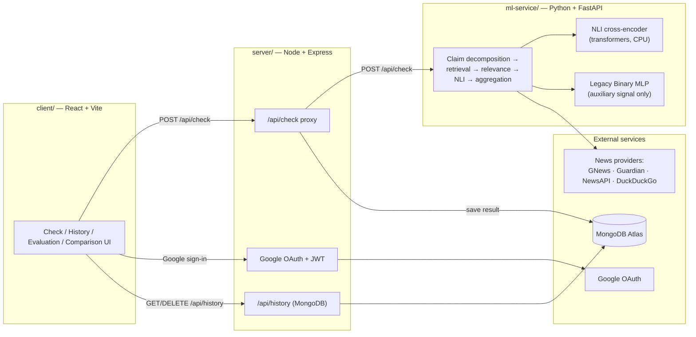
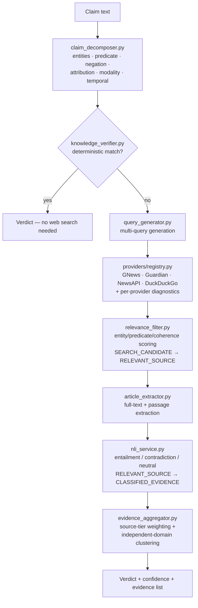

# NewsChecker

**An evidence-first fact-checking system** — paste a claim or a news headline, and NewsChecker decomposes the proposition, retrieves independent evidence from the live web, checks it against the claim with a natural-language-inference (NLI) model, and returns a conservative, evidence-backed verdict. It abstains rather than guesses when the evidence isn't there.

This is a full-stack, three-service application: a React frontend, a Node/Express API gateway, and a Python/FastAPI ML service that owns claim understanding, retrieval, and NLI verification.

<p align="center">
  
</p>

---

## Table of contents

- [What this actually does](#what-this-actually-does)
- [Screenshots](#screenshots)
- [Architecture](#architecture)
- [Design principles](#design-principles)
- [Tech stack](#tech-stack)
- [API reference](#api-reference)
  - [`POST /api/check` response schema](#post-apicheck-response-schema)
  - [`GET /api/health` response schema](#get-apihealth-response-schema)
  - [Auth & history endpoints](#auth--history-endpoints)
- [Database schema](#database-schema)
- [Environment variables](#environment-variables)
- [Local development](#local-development)
- [Testing](#testing)
- [Running this for a demo](#running-this-for-a-demo)
  - [NLI model & memory](#nli-model--memory)
- [Model performance (legacy MLP)](#model-performance-legacy-mlp)
- [Project structure](#project-structure)
- [Known limitations](#known-limitations)
- [License](#license)

---

## What this actually does

Type a claim like *"The US Federal Reserve raised interest rates by 0.25% in its latest meeting"* and NewsChecker:

1. **Understands the claim** — extracts entities, the core predicate/action, negation, attribution ("officials said" vs "officials denied"), modality (factual vs speculative), and temporal constraints.
2. **Applies a deterministic check first**, for claims with an unambiguous, well-known answer (basic arithmetic, textbook science/geometry facts, a small set of verified historical facts) — no web search needed, no ambiguity.
3. Otherwise, **generates multiple targeted search queries** (exact headline, proposition, entity-pair, contradiction/verification queries) and **retrieves candidates** from several providers (GNews, The Guardian, NewsAPI, DuckDuckGo — whichever are configured).
4. **Filters for relevance** using entity/predicate/coherence scoring — a document that merely shares a keyword with the claim (a number, an entity name) does **not** qualify as relevant.
5. **Runs NLI** (natural language inference) on the surviving candidates' passages against the claim, classifying each as entailment (supports), contradiction, or neutral.
6. **Aggregates evidence** — weighting by source tier (primary/fact-check/reporting/unclassified) and counting independent publisher domains, so five articles from one outlet don't outweigh one from another.
7. **Returns a verdict** with a categorical confidence (not a fake-precision percentage) and the actual evidence used — explicitly distinguishing sources that were *found* from sources that were *verified*.

The one thing this system is deliberately built **not** to do: treat "a search result exists" as "evidence." A candidate only becomes evidence after it survives relevance filtering *and* gets classified by NLI. See [Design principles](#design-principles).

## Screenshots

| | |
|---|---|
| **Check a claim** — evidence-first verdict with per-source Verified/Unverified labeling | **How It Works** — the full pipeline, explained |
|  |  |
| **Model Evaluation** — honest, non-inflated legacy-MLP metrics | **Model Comparison** — why the legacy model stays auxiliary |
|  |  |

<!-- This project runs locally for demos rather than staying deployed — see
"Running this for a demo" below for why. If you do stand up a public
deployment later, drop a screenshot of it here. -->

## Architecture

Three independently deployable services:



The evidence pipeline itself, inside `ml-service/`:



## Design principles

These are the non-negotiable rules the codebase is built around — they were the direct fixes for real bugs found during development, not aspirational goals:

- **A search result is not evidence.** A candidate only counts as evidence after it passes relevance filtering *and* gets NLI-classified. The API separates `retrieval.candidate_count` (raw search hits) from `nli.classified_count` (actually checked) from `evidence.supporting_count + contradicting_count + neutral_count` (classified evidence by stance) — and the frontend never collapses these into one number.
- **NLI unavailable ≠ neutral.** If the NLI model can't be reached or fails to load, every score comes back `available: false` and the caller must treat it as abstention — never as a "neutral" classification, which would be a false signal.
- **Search failure ≠ no evidence ≠ false.** `retrieval.status` distinguishes `SEARCH_FAILED` (all providers errored), `NO_RESULTS` (providers ran, found nothing), `NO_RELEVANT_RESULTS` (results found, none relevant), and `SEARCH_SUCCESS`/`SEARCH_PARTIAL`. These are never conflated.
- **The legacy MLP never determines the verdict.** `binary_truth_mlp.py` is a from-scratch neural net trained on the LIAR political-statements dataset. It's shown in the API response (`ml.score`) for transparency, flagged `auxiliary_only: true`, but the verdict computation (`evidence_verdict_score`, `merge_claim_summaries`) never reads it.
- **NLI label order is not standardized across models — never guess it.** Different NLI models emit their entailment/contradiction/neutral labels in different, undocumented orders. `nli_service.py` only trusts a model's real named labels (order-independent) or an explicit, manually-verified per-model lookup table — an unrecognized model emitting raw `LABEL_0`/`LABEL_1`/`LABEL_2` output makes the service report `failed` and abstain, rather than risk silently inverting every verdict.
- **Repeated coverage from one outlet isn't independent confirmation.** `evidence_aggregator.count_independent_groups` counts distinct publisher domains among classified evidence, so five re-posts of the same story don't look like five confirmations.
- **Confidence is categorical, not fake-precision.** The UI shows `low` / `medium` / `high` / `very high`, not a `73.42%` number implying a calibration that doesn't exist. Where a percentage bar *is* shown (evidence-balance visualization), it reads "—" / "Not available" instead of a misleading number when there's no classified evidence to measure.

## Tech stack

| Layer | Technology |
|---|---|
| **Frontend** | React 19, Vite, vanilla CSS (no UI framework), Lucide icons, Google Identity Services |
| **API gateway** | Node.js, Express 5, Mongoose, JSON Web Tokens, `google-auth-library` |
| **ML service** | Python 3.11, FastAPI, Uvicorn, NumPy, Pandas |
| **NLI** | HuggingFace `transformers` + PyTorch (CPU-only wheel), a cross-encoder NLI model |
| **Legacy ML** | From-scratch NumPy MLP + TF-IDF vectorizer (no sklearn/PyTorch) — auxiliary signal only |
| **Search providers** | GNews, The Guardian, NewsAPI (all optional, key-gated), DuckDuckGo HTML (always-on fallback, no key needed) |
| **Database** | MongoDB (Atlas or self-hosted) via Mongoose |
| **Deployment** | Run locally for demos (see [Running this for a demo](#running-this-for-a-demo)); Render + Vercel configs included for reference |

## API reference

### `POST /api/check`

Request:

```json
{ "statement": "The US Federal Reserve raised interest rates by 0.25% in its latest meeting." }
```

`statement` must be 5–2000 characters.

#### `POST /api/check` response schema

This is the actual `CheckResponse` shape from `ml-service/main.py`, proxied unchanged by `server/routes/check.js` (with `_id` attached if the check was saved to history):

```jsonc
{
  "statement": "The US Federal Reserve raised interest rates by 0.25% in its latest meeting.",
  "claim_type": "news",              // "general factual" | "scientific" | "mathematical" | "historical" | "news" | "subjective" | ...
  "verdict": "true",                 // human-readable verdict string
  "confidence": "high",              // "low" | "medium" | "high" | "very high" — categorical, not a percentage

  // The core verification outcome — read this first.
  "verification": {
    "status": "supported",           // "supported" | "contradicted" | "mixed" | "insufficient_evidence" | "not_objectively_verifiable"
    "reasoning": "Relevant external evidence was found and classified."
  },

  // The legacy MLP signal. Advisory only — never drives the verdict.
  "ml": {
    "available": true,
    "auxiliary_only": true,
    "score": 0.61,                   // 0–1 probability from the LIAR-trained MLP
    "verdict": "probably correct",
    "threshold": 0.49
  },

  // What happened during the search phase.
  "retrieval": {
    "status": "SEARCH_SUCCESS",      // "SEARCH_SUCCESS" | "SEARCH_PARTIAL" | "SEARCH_FAILED" | "NO_RESULTS" | "NO_RELEVANT_RESULTS"
    "candidate_count": 14,           // raw search results across all providers/queries, deduplicated
    "relevant_count": 6,             // survived relevance filtering (still NOT yet "evidence")
    "diagnostics": [                 // per-provider, per-query outcome — never silently swallowed
      { "provider": "gnews", "query": "...", "enabled": true, "status": "success", "raw_result_count": 4, "normalized_result_count": 3, "error": null }
    ]
  },

  // NLI model state and how much evidence it actually classified.
  "nli": {
    "available": true,
    "status": "ready",               // "disabled" | "loading" | "ready" | "failed"
    "classified_count": 3            // sources that were actually run through NLI
  },

  // Aggregated evidence AFTER NLI classification — this is the real "evidence used" count.
  "evidence": {
    "supporting_count": 3,
    "contradicting_count": 0,
    "neutral_count": 0,
    "independent_groups": 3          // distinct publisher domains among classified evidence
  },

  // ── Legacy/flattened fields, kept for backward compatibility ──
  "ml_score": 0.61,
  "ml_verdict": "probably correct",
  "ml_threshold": 0.49,
  "evidence_score": 0.85,
  "evidence_stance": { "support": 0.85, "contradiction": 0.02, "net": 0.83, "verdict": "evidence supports the claim", "status": "supported", "..." : "..." },
  "combined_score": 89,              // 5–95 visual evidence-balance score — NOT a probability of truth
  "combined_verdict": "evidence supports the claim",
  "assessment_status": "supported",
  "claim_assessments": [
    { "claim": "...", "status": "supported", "verdict": "evidence supports the claim", "support": 0.85, "contradiction": 0.02, "evidence_count": 3 }
  ],
  "top_evidence": [
    {
      "title": "Fed raises rates by quarter point, signals data-dependent path ahead",
      "url": "https://reuters.com/markets/fed-rate-decision",
      "similarity": 0.0,               // not used as a relevance/truth score, kept for schema compatibility
      "stance": "supports",            // "supports" | "contradicts" | "unclear"
      "source": "Reuters",
      "best_sentence": "The Federal Reserve raised its benchmark interest rate by a quarter percentage point on Wednesday.",
      "support_score": 0.91,
      "contradiction_score": 0.02,
      "source_tier": "reporting",      // "primary" | "fact-check" | "reporting" | "unclassified"
      "nli_available": true            // false ⇒ this is an unverified CANDIDATE, not evidence
    }
  ],
  "processing_time_seconds": 4.1,
  "reasoning": "Relevant external evidence was found and classified.",
  "external_evidence_available": true,
  "external_evidence_checked": true
}
```

**Reading this correctly:** always check `nli_available` (or `nli.classified_count` at the top level) before treating a `top_evidence` entry as confirmation of anything. A source with `nli_available: false` was *found*, not *verified* — the frontend labels these "Unverified" for exactly this reason.

#### `GET /api/health` response schema

```json
{
  "status": "ok",
  "service": "newschecker-ml",
  "model_loaded": true,
  "input_size": 26626,
  "threshold": 0.49,
  "nli": {
    "enabled": true,
    "model": "cross-encoder/nli-deberta-v3-small",
    "status": "ready",
    "error": null
  },
  "search_providers": {
    "gnews":      { "enabled": false, "status": "no_key" },
    "guardian":   { "enabled": false, "status": "no_key" },
    "newsapi":    { "enabled": false, "status": "no_key" },
    "duckduckgo": { "enabled": true,  "status": "ready" }
  }
}
```

No secrets are ever included in this response. This should be the first thing you check when debugging a deployment.

#### Auth & history endpoints

All served by `server/` (Express), all under `/api`:

| Method | Path | Auth | Purpose |
|---|---|---|---|
| `POST` | `/api/auth/google` | — | Exchange a Google ID token for the app's own JWT |
| `GET` | `/api/auth/me` | Bearer JWT | Fetch the logged-in user's profile |
| `GET` | `/api/history?limit=&skip=` | Bearer JWT | Paginated list of the user's past checks (summary fields only) |
| `GET` | `/api/history/:id` | Bearer JWT | Full saved check, same shape as a live `/api/check` response |
| `DELETE` | `/api/history/:id` | Bearer JWT | Delete one saved check |
| `GET` | `/api/health` | — | Express proxy health (separate from the ML service's own `/api/health`) |

## Database schema

`server/models/Check.js` (Mongoose). Stores the full structured response (not just the legacy flattened fields) so that loading a check from history renders identically to a live result:

```js
{
  userId: ObjectId,              // ref User, indexed
  statement: String,
  createdAt / updatedAt,         // automatic timestamps

  // Legacy flattened fields
  mlScore: Number, mlVerdict: String,
  evidenceScore: Number,
  evidenceStance: { support, contradiction, net, verdict },
  combinedScore: Number, combinedVerdict: String,
  assessmentStatus: String,
  claimAssessments: [{ claim, status, verdict, support, contradiction, evidenceCount }],
  topEvidence: [{ title, url, similarity, stance, source, best_sentence,
                  support_score, contradiction_score, source_tier, nli_available }],
  processingTime: Number,

  // Structured schema (mirrors the live CheckResponse)
  claimType: String, verdict: String, confidence: String, reasoning: String,
  externalEvidenceAvailable: Boolean, externalEvidenceChecked: Boolean,
  verification: { status, reasoning },
  ml: { available, auxiliaryOnly, score, verdict, threshold },
  retrieval: { status, candidateCount, relevantCount, diagnostics: [Mixed] },
  nli: { available, status, classifiedCount },
  evidenceSummary: { supportingCount, contradictingCount, neutralCount, independentGroups },
}
```

`server/models/User.js` is a small Google-OAuth profile (`googleId`, `email`, `name`, `avatar`).

## Environment variables

### ML service (`ml-service/` — Render-specific vars matter only if you deploy it)

| Variable | Required? | Default | Notes |
|---|---|---|---|
| `NLI_ENABLED` | No | `true` | Set `false` only to intentionally disable NLI (e.g. emergency memory mitigation). |
| `NLI_MODEL` | No | `cross-encoder/nli-deberta-v3-small` | HuggingFace model id. See [NLI model & memory](#nli-model--memory) before changing this. |
| `GNEWS_API_KEY` | No | — | Enables the GNews provider. Without it, only DuckDuckGo runs. |
| `GUARDIAN_API_KEY` | No | — | Enables The Guardian provider. |
| `NEWSAPI_KEY` | No | — | Enables the NewsAPI provider. |
| `PORT` | No | `8000` | Set automatically by Render; the Dockerfile's `CMD` already handles `${PORT:-8000}`. |

### Server (`server/` — Vercel-specific vars matter only if you deploy it)

| Variable | Required? | Default | Notes |
|---|---|---|---|
| `MONGODB_URI` | **Yes** (for persistence) | `mongodb://localhost:27017/newschecker` | Without a reachable Mongo, the server still boots and `/api/check` still works — history/auth just won't persist. |
| `JWT_SECRET` | **Yes in production** | a hardcoded dev-only string | **The server throws at startup if `NODE_ENV=production` and this is unset** — set it before deploying. |
| `GOOGLE_CLIENT_ID` | **Yes** (for sign-in) | — | From Google Cloud Console. Must match the client's `VITE_GOOGLE_CLIENT_ID`. |
| `FASTAPI_URL` | **Yes** in production | `http://localhost:8000` | Must point at your deployed ML service (Render URL). |
| `CLIENT_URL` | No | `http://localhost:5173` | CORS origin. Only matters if client and server are deployed as separate origins. |
| `ML_SERVICE_TIMEOUT_MS` | No | `60000` | Ceiling on the Node→FastAPI proxy call, so a hung ML service can't hang Express forever. |
| `NODE_ENV` | Set by platform | — | Vercel sets this to `production` automatically — this is what triggers the `JWT_SECRET` requirement above. |

### Client (`client/` — build-time Vite variables, baked in at build)

| Variable | Required? | Default | Notes |
|---|---|---|---|
| `VITE_API_URL` | No | `""` (same-origin) | Only set this if the client is deployed as a **separate** project from the server. |
| `VITE_GOOGLE_CLIENT_ID` | **Yes** (for sign-in) | — | Public Google OAuth client ID — same value as the server's `GOOGLE_CLIENT_ID`. |

## Local development

Requires Node.js 18+, Python 3.9+, and MongoDB (local or Atlas — optional for basic `/api/check` testing).

```bash
# 1. ML service
cd ml-service
python -m venv .venv && source .venv/bin/activate   # optional but recommended
pip install -r requirements.txt
python main.py                          # http://localhost:8000

# 2. Node/Express server (new terminal)
cd server
npm install
npm run dev                             # http://localhost:3001

# 3. React frontend (new terminal)
cd client
npm install
npm run dev                             # http://localhost:5173
```

The first evidence check (a non-deterministic claim) triggers the NLI model download on first use — this can take a minute depending on your connection. Deterministic claims (basic science/math facts) never touch NLI or the network at all.

## Testing

```bash
# ML service — 41 tests covering claim decomposition, relevance filtering,
# query generation, NLI label-mapping safety, evidence aggregation, provider
# failure/diagnostics handling, and FastAPI endpoint behavior.
cd ml-service
pip install -r requirements.txt
python -m pytest tests/ -q
# (falls back to: python -m unittest discover -s tests -v)

# Client — lint + production build
cd client
npm run lint
npm run build
```

There is currently no automated test suite for `server/` (the Express layer) — this is a known gap, not an oversight; see [Known limitations](#known-limitations).

## Running this for a demo

**This project is run locally, not deployed to an always-on public host.** Real NLI inference (a transformer model, PyTorch) is expensive to host reliably on free-tier infrastructure — a small instance either can't fit the model in memory or has to compromise on accuracy to fit, and it sleeps/cold-starts when idle. A live link that occasionally shows a mid-restart or a 60-second cold start makes the project look worse than not having one.

For a demo (an interview, a walkthrough), run all three services locally per [Local development](#local-development) — on a normal dev machine there's several GB of headroom, so the full-accuracy NLI model runs comfortably. This also means you're demoing from an environment you control, with no cold-start or infra surprises mid-conversation.

The deployment instructions below are kept for reference (e.g. if you want a permanent public link and are fine with the hosting cost that requires), not because the project currently runs on them.

<details>
<summary>Deployment instructions (optional — not currently in use)</summary>

### ML service → Render

The Dockerfile is self-contained (CPU-only PyTorch wheel, single Uvicorn worker, conservative thread limits). Point a Render Web Service at `ml-service/` with the Dockerfile build. See [Environment variables](#environment-variables) above for what to set. **Use at least a 2GB-RAM instance** — see [NLI model & memory](#nli-model--memory) below for why.

### Client + server → Vercel

The root `vercel.json` builds `client/` as a static site and `server/api/index.js` as a serverless function, with `/api/*` rewritten to the server — meaning client and server are typically **one Vercel project**, same origin, so `VITE_API_URL` can usually stay unset. `server/vercel.json` exists separately if you want to deploy the server as its own project instead (in which case you do need `VITE_API_URL` and `CLIENT_URL`).

</details>

### NLI model & memory

`NLI_MODEL` defaults to `cross-encoder/nli-deberta-v3-small` (~141M parameters, ~560MB of fp32 weights) for its stronger entailment/contradiction accuracy — the right default for local use, where memory isn't the constraint.

If you do deploy this on a small always-on instance (512MB), that model reliably triggers OOM restarts — PyTorch's own import footprint (300–500MB, independent of model choice) plus the model weights adds up fast. In that case, set `NLI_MODEL=cross-encoder/nli-MiniLM2-L6-H768` (~22M parameters, ~6x smaller) instead, and budget for the instance to need 1GB+ regardless of model choice. `-deberta-v3-small`, `-deberta-v3-base`, `-deberta-v3-xsmall`, and `-MiniLM2-L6-H768` are all pre-verified in `nli_service.py`'s label-order table. **If you set a different model entirely**, verify it after deploying:

1. Check `/api/health` → `nli.status` should be `"ready"`.
2. Check the service logs for a line like `NLI model loaded: <model> — id2label={...}` to confirm what label scheme it actually uses.
3. If `nli.status` comes back `"failed"` with an "unrecognized label" error, the model emits raw `LABEL_0`/`LABEL_1`/`LABEL_2` output that isn't in the verified table — the service is correctly refusing to guess its order. Add it to `_KNOWN_INDEXED_LABEL_ORDERS` in `nli_service.py` only once you've confirmed the real order from the model's config.

## Model performance (legacy MLP)

The **Binary Truth MLP** (`binary_truth_mlp.py`) is a from-scratch NumPy neural network (no PyTorch/sklearn) trained on the **LIAR dataset** (12,836 labeled political statements), collapsed from 6 classes to binary "Fake-ish"/"True-ish".

> ⚠️ The commonly-cited **72.38%** LIAR result uses speaker metadata (party, job, historical truth counts) that the production API never receives. That number must never be shown as this system's real-world accuracy.

The production-equivalent, statement-only evaluation:

| Metric | Value |
|---|---|
| Accuracy | 62.35% |
| Precision | 63.18% |
| Recall | 79.55% |
| F1 Score | 0.7043 |
| Brier score | 0.2262 |

This model is **never used to determine the final verdict** — see [Design principles](#design-principles). It's kept visible in the API response and on the Model Evaluation/Comparison pages purely for research transparency. Reproduce these numbers with:

```bash
cd ml-service
python evaluate_production_model.py
```

## Project structure

```
newschecker/
├── client/                       React + Vite frontend
│   └── src/
│       ├── App.jsx                Root component, routing, API calls
│       └── components/            Header, EvidenceCard, ScoreGauge, ScoreBreakdown,
│                                   HowItWorks, ModelEvaluation, ModelComparison,
│                                   HistoryPanel, LoadingSkeleton
├── server/                       Node/Express API gateway
│   ├── api/index.js                Express app entry (also the Vercel serverless handler)
│   ├── routes/                     check.js (ML proxy), auth.js (Google OAuth), history.js
│   ├── middleware/auth.js          JWT sign/verify
│   └── models/                     Check.js, User.js (Mongoose schemas)
├── ml-service/                   Python/FastAPI ML service
│   ├── main.py                     FastAPI app, /api/health, /api/check
│   ├── claim_decomposer.py         Entities, predicates, negation, attribution, modality
│   ├── query_generator.py          Multi-query generation per claim
│   ├── providers/                  GNews, Guardian, NewsAPI, DuckDuckGo + registry/diagnostics
│   ├── relevance_filter.py         Candidate → relevant-source filtering
│   ├── article_extractor.py        Full-text + passage extraction
│   ├── nli_service.py              Single authoritative NLI service (state machine + label safety)
│   ├── evidence_aggregator.py      Stance aggregation + independent-source clustering
│   ├── evidence_pipeline.py        Orchestrates the stages above
│   ├── knowledge_verifier.py       Deterministic checks (arithmetic, well-known facts)
│   ├── binary_truth_mlp.py         Legacy auxiliary MLP (from-scratch NumPy)
│   ├── tfidf.py                    From-scratch TF-IDF vectorizer (feeds the legacy MLP only)
│   ├── classifier.py / mlp_classifier.py   Experimental baselines, offline evaluation only
│   ├── evaluate_models.py / evaluate_production_model.py   Offline evaluation scripts
│   └── tests/                      41 tests across the modules above
├── docs/screenshots/              README images
├── IMPROVEMENTS.md                 Dated engineering log of major fixes/audits
└── vercel.json                     Client + server deployment config
```

## Known limitations

Being direct about these matters more than pretending they don't exist:

- **No automated test suite for `server/`** (the Express layer) — `check.js`, `auth.js`, `history.js` are untested. The ML service and frontend build are covered; this is the biggest remaining test gap.
- **Retrieval quality depends on live web search.** Without `GNEWS_API_KEY`/`GUARDIAN_API_KEY`/`NEWSAPI_KEY` configured, the system falls back to DuckDuckGo's HTML search alone, which is less comprehensive for very fresh or niche stories. The system is designed to abstain (`NO_RELEVANT_RESULTS` / `insufficient_evidence`) rather than force a weak match — but retrieval recall is still bounded by what's actually configured and reachable at request time.
- **No temporal-validity checking.** The pipeline doesn't currently compare an article's publish date against the claim's implied timeframe — a stale article about an old event could theoretically be classified as evidence for a claim about current events, if it happens to pass relevance and NLI. This is a known gap, not yet implemented.
- **Claim decomposition is regex-based, not a real parser.** `claim_decomposer.py` uses pattern matching for entities/predicates/negation/modality, not dependency parsing or a trained NER model. It works well for the claim shapes it's been tested against but isn't as robust as a full NLP pipeline would be.
- **The legacy MLP's LIAR training data is US-political-statement-specific.** It's explicitly auxiliary and excluded from the verdict for exactly this reason — it isn't a general-purpose truth classifier and was never intended to be one in production.

## License

MIT.
